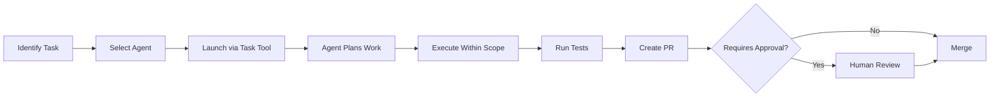

# CopperCore ERP — Agent System

> **Purpose:** Define the mandatory agent-based development system for CopperCore ERP.  
> All development work MUST be performed through the appropriate agent using the Task tool.

---

## 🎯 Active Agents

These agents are configured and ready for use via the Task tool:

| Agent | Purpose | Key Responsibilities |
|-------|---------|---------------------|
| **planning-coordinator** | Project Planning & Coordination | Analyzes requirements, creates task breakdowns, coordinates multi-agent work |
| **architect-erp** | Database & Security Architecture | Schema design, migrations, RLS policies, security reviews, ADRs |
| **backend-developer** | API & Business Logic | Service layers, API endpoints, realtime events, optimistic locking |
| **frontend-developer** | React UI Development | Components, TypeScript, TanStack Query, Supabase Realtime, scanners |
| **qa-test-engineer** | Testing & Quality | Test creation, E2E Playwright, RLS validation, regression testing |
| **devops-engineer** | Infrastructure & CI/CD | Pipelines, deployments, secrets, monitoring, rollbacks |
| **docs-pm** | Documentation & PM | PRD alignment, ADRs, release notes, changelogs, specifications |
| **code-linter** | Code Quality | ESLint, Prettier, TypeScript checks, formatting, cleanup PRs |

---

## 📋 How to Use Agents

### Starting Work
```
1. Start with planning-coordinator for complex tasks
2. Get actionable plan with agent assignments
3. Execute plan using specialized agents
4. Test with qa-test-engineer
5. Document with docs-pm
```

### Example Usage
```
Task: "Implement the GRN workflow from PRD section 5.7"
→ Start: planning-coordinator (creates plan)
→ Then: architect-erp (schema), backend-developer (API), frontend-developer (UI)
→ Finally: qa-test-engineer (tests)

Task: "Create a new API endpoint for inventory tracking"
→ Use: backend-developer agent

Task: "Add RLS policy for new table"
→ Use: architect-erp agent (requires approval)

Task: "Fix TypeScript errors in components"
→ Use: code-linter agent

Task: "Write E2E tests for GRN workflow"
→ Use: qa-test-engineer agent
```

---

## 🔒 Agent Permissions & Guardrails

### Universal Restrictions (All Agents)
- **Production Database:** Read-only access
- **Secrets:** Never commit credentials
- **Approval Required:** Schema, RLS, pricing, numbering changes

### Agent-Specific Permissions

#### planning-coordinator
- **Can:** Analyze requirements, create plans, assign tasks to agents
- **Cannot:** Directly modify code or infrastructure
- **Tools:** filesystem, github, web-search
- **Output:** Actionable task lists with agent assignments

#### architect-erp
- **Can:** Design schemas, create migrations, define RLS policies
- **Cannot:** Deploy to production, modify pricing logic
- **Requires Approval:** All schema/RLS changes

#### backend-developer
- **Can:** Implement services, APIs, business logic (non-pricing)
- **Cannot:** Alter RLS policies, modify audit trails
- **Tools:** filesystem, github, postgres (dev/staging RW)

#### frontend-developer
- **Can:** Create React components, manage UI state, realtime subs
- **Cannot:** Direct database access, backend logic changes
- **Tools:** filesystem, github, web-search, puppeteer

#### qa-test-engineer
- **Can:** Write/run tests, seed test data, validate RLS
- **Cannot:** Modify application code, deploy changes
- **Tools:** filesystem, testsprite, playwright, postgres (dev RW)

#### devops-engineer
- **Can:** Configure CI/CD, manage deployments, handle rollbacks
- **Cannot:** Modify business logic, alter RLS policies
- **Requires Approval:** Production deployments, secret changes

#### docs-pm
- **Can:** Update documentation, create ADRs, write release notes
- **Cannot:** Modify code, alter configurations
- **Tools:** filesystem, github, web-search

#### code-linter
- **Can:** Fix linting issues, format code, resolve type errors
- **Cannot:** Change functionality, alter business logic
- **Tools:** filesystem, github

---

## 🚦 Approval Gates

### Changes Requiring Approval
1. **Database Schema** → architect-erp + human review
2. **RLS Policies** → architect-erp + CEO/Director
3. **Pricing Logic** → Blocked (no agent can modify)
4. **Numbering Series** → Blocked (no agent can modify)
5. **Audit Trails** → architect-erp + security review
6. **Production Deploy** → devops-engineer + release manager

### Approval Process
1. Agent creates ADR in `/docs/adr/`
2. Opens PR with `Requires Approval` label
3. Human reviews and approves
4. Agent proceeds with implementation

---

## 📁 Agent Configuration Files

### Project Agents (Active)
Located in `.claude/agents/`:
- Used by Task tool automatically
- Contain full system prompts and guardrails
- Define MCP tool permissions

### Reference Configurations
Located in `CLAUDE/agents/`:
- Template configurations for reference
- Document agent capabilities
- Define scope boundaries

---

## 🔄 Agent Workflow Integration

### Standard Development Flow


### Multi-Agent Collaboration
When a task spans multiple domains:
1. **Primary agent** owns the task
2. **Secondary agents** handle specific aspects
3. **Handoffs** documented in SESSION_MEMORY.md
4. **Integration** tested by qa-test-engineer

---

## 📊 Agent Performance Metrics

Track in `/docs/logs/agents/`:
- Tasks completed per agent
- Test coverage achieved
- PRs created and merged
- Issues identified and resolved
- Approval requests and outcomes

---

## 🚨 Common Pitfalls to Avoid

### ❌ DON'T
- Work without an agent context
- Mix responsibilities between agents
- Bypass approval gates
- Ignore test failures
- Commit directly to main

### ✅ DO
- Always use Task tool with correct agent
- Respect agent boundaries
- Request approval when needed
- Write tests first
- Create PRs for review

---

## 📚 Related Documentation

- **[CLAUDE.md](./CLAUDE.md)** — Main operational guide
- **[PRD-v1.5.md](./docs/PRD/PRD-v1.5.md)** — Product requirements
- **[/docs/prompts/](./docs/prompts/)** — Task-specific prompts
- **[/docs/logs/](./docs/logs/)** — Session memory and checklists

---

## Quick Reference Card

```bash
# Planning complex features
Task tool → planning-coordinator

# Frontend work
Task tool → frontend-developer

# Backend API
Task tool → backend-developer

# Database changes
Task tool → architect-erp (needs approval)

# Writing tests
Task tool → qa-test-engineer

# Deployment
Task tool → devops-engineer

# Documentation
Task tool → docs-pm

# Code cleanup
Task tool → code-linter
```

---

**Remember:** Every line of code in CopperCore must be written by an agent. This ensures consistency, security, and compliance with PRD requirements.